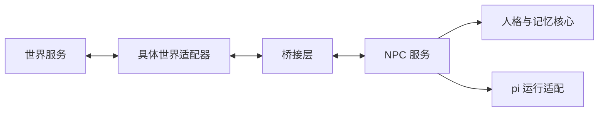

# 顶层架构

状态：初始设计，2026-10-01。本文确定模块职责；具体接口字段、存储后端和运行策略将在 NPC 层设计中细化。

## 两个业务模块，一套共享协议

系统由 NPC 服务和世界构成。双方通过共享协议交换观察、行动提案和结果，适配层负责把具体世界的数据转换成协议。

桥接是逻辑边界，第一阶段不要求单独部署第三个服务。可以先由普通代码与持久化队列实现。

## 模块职责

| 目录 | 职责 | 边界 |
| --- | --- | --- |
| `apps/npc-service` | 组装模块；角色注册、事件唤醒、任务调度和服务生命周期 | 不承载游戏规则 |
| `packages/npc-core` | 人格、身份、记忆、关系认知、目标与决策流程；定义模型和存储接口 | 不依赖 pi、Convex 或游戏引擎 |
| `packages/pi-runtime` | 调用 pi；处理上下文、工具循环、中断和模型运行事件 | 对外实现 NPC 核心定义的接口 |
| `packages/protocol` | 世界能力、观察、行动、结果、公开资料的数据契约 | 不暴露模型 SDK 类型、数据库行或游戏内部对象 |
| `packages/bridge` | 消息交付、行动领取、回执、游标与重复交付处理 | 不推断人格，不决定游戏规则 |
| `adapters/ai-town` | 把 AI Town 的实体、事件和操作映射到共享协议 | 当前只预留目录 |
| `worlds` | 未来世界实现的位置 | 当前只预留目录 |

长期记忆在 `npc-core` 的边界内管理，具体数据库实现可在后续设计中拆分。当前不提前规定数据库或向量检索产品。

## 依赖方向

- `protocol` 保持为独立的数据契约包。
- `npc-core` 可以使用 `protocol`，通过自己定义的接口调用模型和存储。
- `pi-runtime` 实现 `npc-core` 的运行接口；依赖方向由适配实现指向核心。
- `bridge` 使用 `protocol`，不依赖人物内部状态。
- `npc-service` 组装 `npc-core`、`pi-runtime` 和 `bridge`。
- 世界适配器依赖 `protocol` 与桥接接口，连接各自的世界实现。

这样更换 pi 或更换世界，都有明确的替换边界。

## 数据与执行闭环

1. 世界按可见范围生成角色观察，包括场景变化、听到的话和行动结果。
2. 桥接层将观察交给对应的 NPC 实例。
3. NPC 读取自己的记忆与目标，通过运行适配生成行动提案。
4. 世界后端从桥接层领取提案，检查当前场景并执行。
5. 世界返回接受、执行中、完成、失败或拒绝等结果。
6. NPC 根据结果更新计划和记忆；其他角色仅收到世界判定它们能够感知的新事件。

消息交付确认和行动执行完成是两种不同状态。生成一句话不等于已经说出，更不等于对方已经同意。

第一版拟使用以下协议类别，具体 schema 尚未冻结：

| 类别 | 作用 |
| --- | --- |
| `WorldCapabilities` | 声明可用动作、地点引用与时间语义 |
| `Observation` | 表示某个角色收到的信息及其来源 |
| `ActionProposal` | 表示角色希望采取的行动 |
| `ActionResult` | 表示世界对行动的确认与实际结果 |
| `PublicProfile` | 表示允许展示的姓名、简介和外观资料 |

每次实验需要独立的运行标识；事件与行动需要唯一标识、顺序或游标、关联关系及必要的有效期。桥接与执行端共同处理重复交付，行动成功与否以世界结果为准。

## 信息与记忆边界

- 世界记录实际事件；NPC 保存自己对事件的观察和理解。
- 私有身份、原始人格材料和未表达的意图保留在 NPC 侧。
- 公开简介单独提供给世界，其他角色的认识来自它们实际获得的信息。
- 区分“亲历”“听说”“推测”“计划”，并保留来源。
- 初始人格可以复用；不同世界实验中的角色实例分别积累记忆。
- pi 会话历史与压缩摘要不能成为人格和长期记忆的唯一存储。
- 世界时间负责活动、约定与经历；真实时间负责网络超时和运行监测。

## 第一阶段边界

先验证少量人物的自主行动、对话延续、人格一致性和私有信息隔离。角色初始身份统一。复杂社会机制留待后续设计。

世界实现与 AI Town 接入暂不开发。NPC 层可先在简单文字场景中验证，再通过适配器接入小镇。

## 技术依据

- [pi agent-core](https://github.com/earendil-works/pi/blob/main/packages/agent/README.md)：可嵌入的 agent 循环及上下文、工具和事件扩展点。
- [AI Town 架构](https://github.com/a16z-infra/ai-town/blob/main/ARCHITECTURE.md)：世界输入、游戏引擎与异步 agent 操作的现有边界。

以上用于说明设计背景，不代表当前骨架已经集成这些项目。
