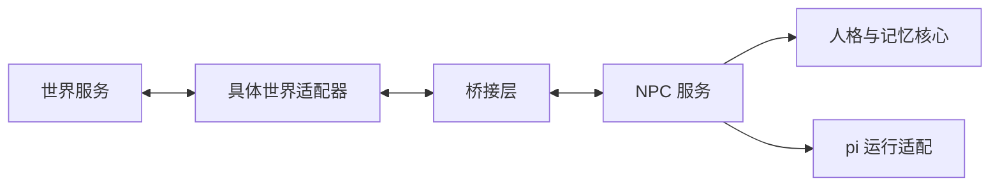

# 顶层架构

状态：2026-10-02 更新，第一阶段世界为 Minecraft。人格与检索、独立持久记忆、pi 工具循环、原生游戏行动和四 NPC 调度已接通，本地 CLIProxyAPI 工具调用已验证。本文区分当前实现与后续跨世界协议目标；真实协作击败末影龙的结果仍需完整实测。

## 两个业务模块，一套共享协议

系统由 NPC 服务和世界构成。双方通过共享协议交换观察、行动提案和结果，适配层负责把具体世界的数据转换成协议。

桥接是逻辑边界，第一阶段不要求单独部署第三个服务。当前使用同进程函数和内存事件队列，世界记忆单独落盘；持久交付队列尚未实现。

## 模块职责

| 目录 | 职责 | 边界 |
| --- | --- | --- |
| `apps/npc-service` | 文字角色会客室入口；共享人格和运行模块 | 当前 Minecraft 生命周期由其适配器入口组装，不承载通用游戏规则 |
| `packages/npc-core` | 人格、身份、记忆、关系认知、目标与决策流程；定义模型和存储接口 | 不依赖 pi、Convex 或游戏引擎 |
| `packages/pi-runtime` | 调用 pi；处理上下文、工具循环、中断和模型运行事件 | 对外实现 NPC 核心定义的接口 |
| `packages/protocol` | 世界能力、观察、行动、结果、公开资料的数据契约 | 不暴露模型 SDK 类型、数据库行或游戏内部对象 |
| `packages/bridge` | 已有事件合并、唤醒、并发限制、取消和错误退避；后续扩展持久交付 | 不推断人格，不决定游戏规则 |
| `adapters/minecraft` | Minecraft 的观察、原生行动、执行结果和试炼管理入口 | 通过最小 port 接入 NPC，正式跨世界 schema 尚待冻结 |
| `adapters/ai-town` | 其他世界的历史候选位置 | 当前只预留目录，不是本阶段接入目标 |
| `worlds` | 世界集成说明和后续实现的位置 | 当前 Minecraft 存档与运行资源位于被 Git 忽略的 `var/minecraft/` |

长期记忆在 `npc-core` 内管理，目前采用按 NPC 与角色 ID 分隔的 JSONL，近期记录配合关键词检索。当前没有依赖数据库或向量检索服务。

### 当前原型与目标边界的差距

`adapters/minecraft/src/world.ts` 和 `native-actions.ts` 集中封装观察、身体行动、并发锁和回执。`llm.ts` 只负责适配 NPC 身体与任务生命周期，pi Agent 已移入 `packages/pi-runtime/src/world-agent.ts`；人格读取、检索与记忆存储在 `npc-core` 中。

`WorldAgentPort` 当前提供 `observe()`、`execute()` 与公开场景资料，不向 pi 暴露 Mineflayer 实例。`bridge` 已实现世界无关的 `NpcScheduler`，支持角色串行、最多四人并发、事件合并和停止；`protocol` 中列出的正式契约、可靠消息交付与跨世界运行 ID 仍未完成。

模型调用由 `packages/pi-runtime/src/model.ts` 统一配置。本地 EasyCLIProxyAPI 是模型服务入口，Mineflayer 是世界执行入口，二者互不替代。完整路径是“NPC 上下文与 pi 循环 → 模型接口”以及“NPC 行动 → Minecraft 适配器 → 世界结果”。

## 依赖方向

- `protocol` 保持为独立的数据契约包。
- `npc-core` 可以使用 `protocol`，通过自己定义的接口调用模型和存储。
- `pi-runtime` 实现 `npc-core` 的运行接口；依赖方向由适配实现指向核心。
- `bridge` 使用 `protocol`，不依赖人物内部状态。
- `npc-service` 组装 `npc-core`、`pi-runtime` 和 `bridge`。
- 世界适配器依赖 `protocol` 与桥接接口，连接各自的世界实现。

这样更换 pi 或更换世界，都有明确的替换边界。

## 数据与执行闭环

1. 世界按可见范围生成角色观察，包括场景变化、听到的话和行动结果。
2. 桥接层将观察交给对应的 NPC 实例。
3. NPC 读取自己的记忆与目标，通过运行适配生成行动提案。
4. 当前由 port 直接调用世界执行器，检查场景和距离后执行；未来可替换成从队列领取。
5. 当前世界返回完成、失败或取消回执；接受和执行中等异步阶段属于后续协议扩展。
6. NPC 根据结果更新计划和记忆；其他角色仅收到世界判定它们能够感知的新事件。

消息交付确认和行动执行完成是两种不同状态。生成一句话不等于已经说出，更不等于对方已经同意。

第一版拟使用以下协议类别，具体 schema 尚未冻结：

| 类别 | 作用 |
| --- | --- |
| `WorldCapabilities` | 声明可用动作、地点引用与时间语义 |
| `Observation` | 表示某个角色收到的信息及其来源 |
| `ActionProposal` | 表示角色希望采取的行动 |
| `ActionResult` | 表示世界对行动的确认与实际结果 |
| `PublicProfile` | 表示允许展示的姓名、简介和外观资料 |

每次实验需要独立的运行标识；当前试炼、事件、行动与任务已有 ID，记忆按来源 ID 去重。持久消息游标、有效期、跨重启重复行动处理尚未实现。行动成功与否以世界结果为准，未来桥接与执行端还需要共同处理重复交付。

## 信息与记忆边界

- 世界记录实际事件；NPC 保存自己对事件的观察和理解。
- 私有身份、原始人格材料和未表达的意图保留在 NPC 侧。
- 公开简介单独提供给世界，其他角色的认识来自它们实际获得的信息。
- 区分“亲历”“听说”“推测”“计划”，并保留来源。
- 初始人格可以复用；不同世界实验中的角色实例分别积累记忆。当前文件按 worldId、NPC 名称和 roleId 分隔；同一世界重启会续用记忆，生存实验和旧末地诊断各用自己的命名空间。
- pi 会话历史与压缩摘要不能成为人格和长期记忆的唯一存储。
- 世界时间负责活动、约定与经历；真实时间负责网络超时和运行监测。

## 第一阶段边界

先验证少量人物的自主行动、对话延续、人格一致性和私有信息隔离。角色初始身份统一。复杂社会机制留待后续设计。

当前端到端场景是 [四人格完整生存实验](minecraft-survival.md)：随机主世界、空手出生、Easy 难度和正常生存规则，由 NPC 自行观察、协商、准备资源和探索，最终进入末地击败龙。管理端只记录进展并核对服务器胜利证据。直接进入末地的旧试炼保留作战斗诊断。相遇、交谈、分开后再见面的场景仍作为人格、记忆和信息隔离对照。

## 技术依据

- [pi agent-core](https://github.com/earendil-works/pi/blob/main/packages/agent/README.md)：可嵌入的 agent 循环及上下文、工具和事件扩展点。
- [Mineflayer](https://github.com/PrismarineJS/mineflayer)：当前 Minecraft Bot 的世界观察和执行基础。
- [Minecraft 接入说明](../adapters/minecraft/README.md)：本地运行、已实现 API 与验证边界。

当前已有 pi、按世界隔离的记忆、调度和 Mineflayer 原生执行的闭环；正式跨世界协议、长期生存能力和效果评估继续沿上述边界完善。
