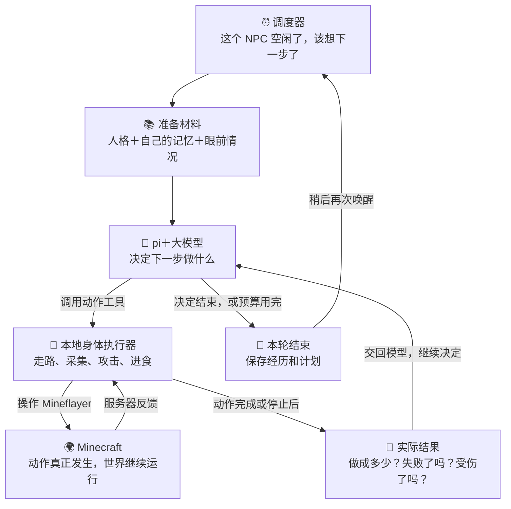
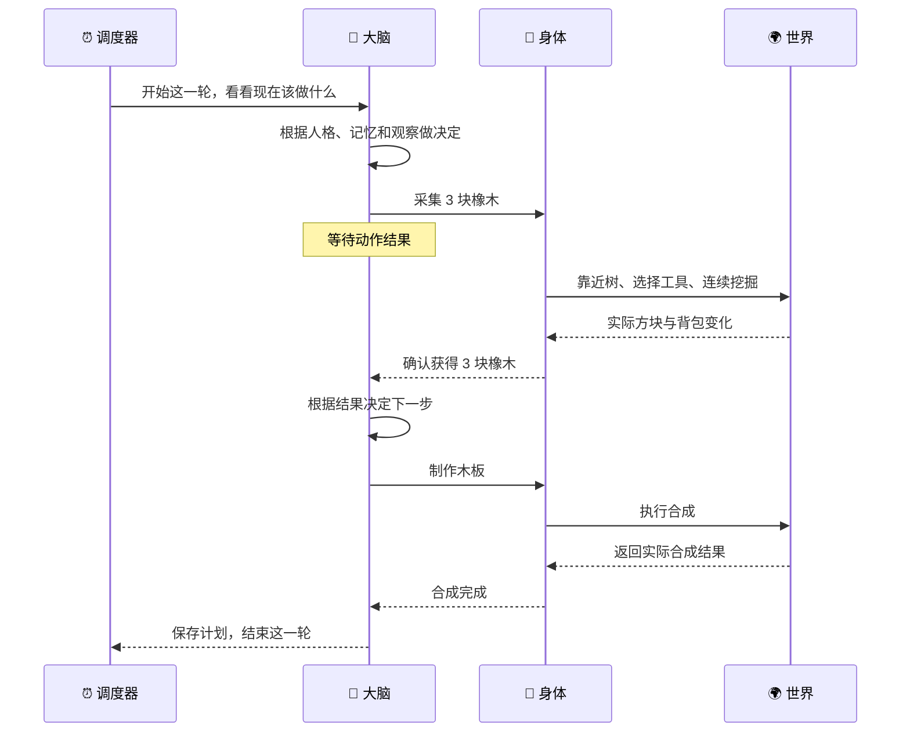
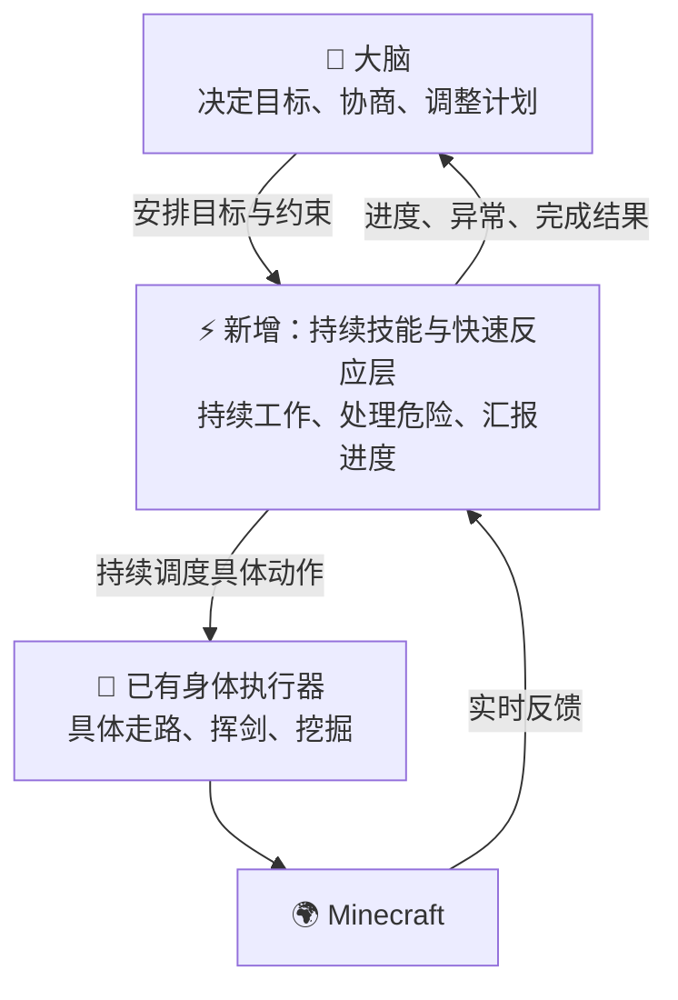

# NPC 如何运行：三张架构图

记录日期：2026-10-02。前两张图说明本次讨论时的代码结构；第三张是下一步设计方向，不表示已经实现。

## 1. 当前整体流程

**调度器负责叫醒，大脑负责决定，身体负责执行。**

一次唤醒可以包含多次模型调用和多个动作，不是每走一步都重新唤醒 NPC。不同 NPC 可以并行运行；单个 NPC 的主决策链主要按“思考 → 等待动作 → 接收结果 → 再思考”推进。

## 2. 一轮任务的例子：砍树后制作木板

这是成功路径的示例；实际执行也可能返回失败、取消或部分完成，模型需要根据真实回执重新决定。

- 身体执行期间，不需要模型指挥每次按键。“采集 3 块木头”内部已经包含连续操作。
- 身体执行完，大脑才能拿到结果继续这一条思考链；大脑思考时，通常没有另一个系统继续安排身体行动。世界里的怪物、重力、时间仍然照常运行。
- 现有受伤通知、动作中断和已授权的限时浮水姿态是补充机制；上图省略这些旁路，聚焦主流程。

## 3. 下一步设计：增加持续技能与快速反应层

**以下为设计方向，尚未实现为完整的独立快速行为系统。**

变化在于：大脑正在想事情时，中间这层仍然工作，身体不必一直等下一次模型回答。实现时还需要统一的身体控制权、优先级、取消与收尾机制。

## 对应代码

| 图中的部分 | 当前代码入口 |
| --- | --- |
| Minecraft 与调度器接线 | [server.ts](../adapters/minecraft/src/server.ts) |
| 调度器 | [npc-scheduler.ts](../packages/bridge/src/npc-scheduler.ts) |
| 准备人格、记忆与世界接口 | [llm.ts](../adapters/minecraft/src/llm.ts) |
| pi 思考与工具循环 | [world-agent.ts](../packages/pi-runtime/src/world-agent.ts) |
| 人格与记忆 | [world-persona.ts](../packages/npc-core/src/world-persona.ts)、[world-memory.ts](../packages/npc-core/src/world-memory.ts) |
| 身体动作入口与锁 | [world.ts](../adapters/minecraft/src/world.ts) |
| 本地动作执行 | [native-actions.ts](../adapters/minecraft/src/native-actions.ts)、[survival-actions.ts](../adapters/minecraft/src/survival-actions.ts) |

进一步说明见 [顶层架构](architecture.md)。
